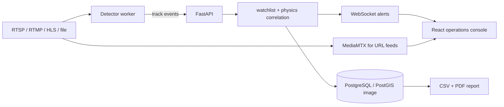
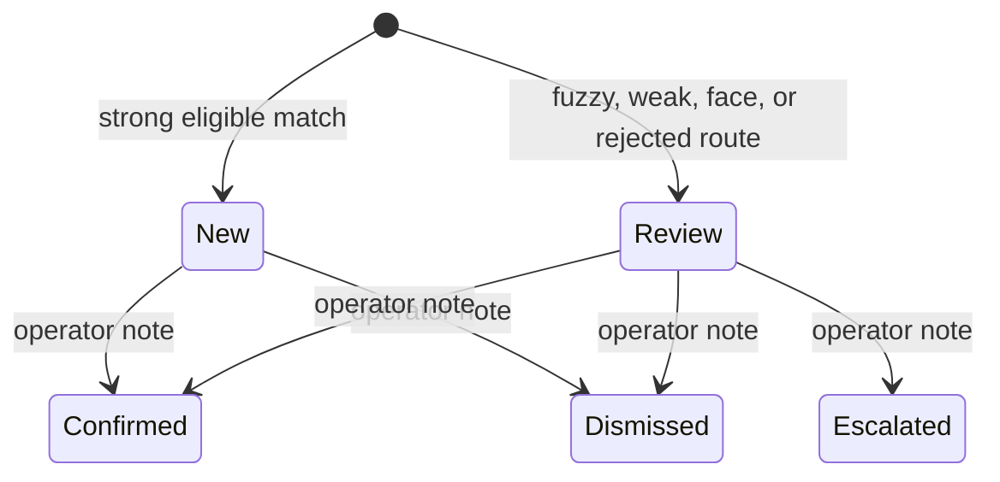

# Sentinel Gujarat — pilot high-level design

## 1. Scope and model choice

The pilot uses a hybrid pattern: a normalized camera registry and unified operations view at the centre, with analytics positioned to move to the edge. The runnable code is a **single-host pilot**. It proves the metadata path and operator workflow; 80,000 camera scale is a proposed deployment shape, not a tested claim. Reference Models 1–5 must be mapped against the official portal brief before submission because that content was not available publicly during this build.

## 2. Implemented data flow

`Camera Passport` probes codec, frame rate, and resolution with `ffprobe`; it stores protocol, URL, department, and coordinates. File uploads are stored locally. The API does not expose source URLs in ordinary camera responses. MediaMTX is controlled through its v3 API. Browser playback uses its WebRTC page; a camera must supply a browser-compatible codec such as H.264.

The console's camera wall includes three short **public Delhi sample replays** as visual placeholders for the seeded Ahmedabad map locations. Replay labels are always visible. Synthetic event records are separate from those clips and do not claim to be detections from them.

## 3. Analytics and correlation

The detector samples every third frame. YOLO11n + ByteTrack produces vehicle tracks. An optional YOLO plate detector can be supplied through `PLATE_MODEL`; the included baseline uses OpenCV contour proposals. Tesseract OCR reads candidate crops. A track emits one observation, with the best plate and three candidates selected by weighted vote. Weak and unreadable reads remain visible. The baseline is intended to be replaced with an Indian-plate model for a judged ANPR demonstration.

Watchlist entries record identifier, kind, category, authority, approval, and expiry. Exact plate matches can produce P1 alerts. One-character fuzzy matches go to review. YuNet/SFace face embeddings are created only for approved-list use; enrollment requires an administrator plus a separate reviewer. The worker discards unmatched face embeddings. A face alert is advisory until an operator confirms it.

For a second plate sighting, the gate computes great-circle distance times a 1.35 road detour factor divided by the time gap. Speeds above 160 km/h are rejected from immediate action and sent to review. This needs camera coordinates and synchronized source clocks. It is not a road-routing result, and a field decision always needs human verification.

## 4. Alert lifecycle and evidence

Material actions append a SHA-256 record containing actor, action, payload, timestamp, and previous digest. The verifier recomputes the chain and reports the first broken record. Each alert can export a PDF evidence packet with observation details, model/source labels, a snapshot SHA-256 digest when an image exists, and the alert-creation audit digest. This is tamper **evidence**, not an immutable external timestamp or signed forensic seal.

## 5. Interoperability and 80,000-camera expansion

At 2 Mbit/s per camera, centralizing 80,000 full-time streams would require about 160 Gbit/s before protocol overhead. The proposed deployment has site or district edge gateways, per-camera analytics workers, and a regional metadata bus. Video remains local unless an operator opens a feed or requests evidence. Workers can partition by camera group. Postgres storage would partition detections by time and region; PostGIS spatial indexes and a routed camera-pair distance table replace the pilot's scalar coordinates and detour factor. A durable event bus (NATS JetStream or Kafka), idempotency keys, replay, and backpressure are needed before state-scale operation. None of those capacity claims has been measured in this repo.

ONVIF Profile S/T/G discovery, vendor VMS adapters, credential rotation, clock-health monitoring, object storage with retention, SSO/Keycloak, independent audit anchoring, and GPU scheduling are integration work for a departmental pilot. The current API supports URL feeds and file uploads but does not automatically discover NVRs.

## 6. Security and department prerequisites

The local UI has signed sessions and three roles. All published Compose ports bind to localhost. Face enrollment is two-person approved and expires. Export and alert review are authenticated. Local test credentials in `.env.example` must be changed before any network exposure. A production gateway must protect MediaMTX directly; the pilot's local WebRTC port is not separately authenticated. JWT media URLs are suitable for local testing only because proxy logs can retain them.

Departments must supply camera inventory and GPS points; resolution, FPS, direction and lens information; RTSP/ONVIF/VMS access; NAT/VPN and bandwidth details; NTP synchronization; authorized watchlist sources and update rules; retention and evidence-export policy; and named approvers for face entries. Without capture-time clock integrity, a physics gate verdict is only advisory.

## 7. Evaluation gates

Record actual numbers from a labelled clip set before submission: vehicle recall, plate exact-read rate, unreadable rate, false alerts before/after the gate, p50/p95 frame-to-alert latency, and camera onboarding time. The integration test verifies behavior, but it is **not** a model-accuracy or throughput benchmark. The public sample clip is poor for ANPR and is not a government feed. The own-feed and government-feed video deliverables still require their respective authorized sources.
